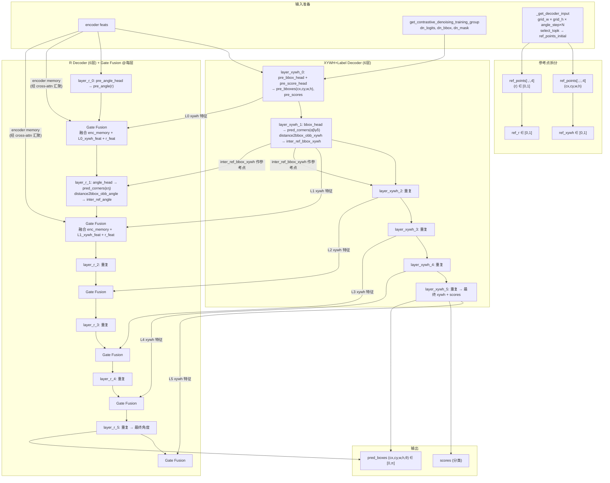

# DEIMv2-OBB Decoder 解耦设计

> 创建日期：2026-06-25
> 修订日期：2026-06-26（根据整合评审 + 原始设计回归修正）
> 目的：解决分类分数与 IoU 质量无关（MAL loss 不收敛）的问题，对 decoder 进行空间-语义-角度三层解耦
> 状态：评审后修订版，待实施
> 原始设计来源：`/mnt/d/cx/apps_data/obsidian_notes/brook_pkm/知识/文献研究/目标检测/DETR系列/DEIM/DEIMv2-OBB调整与优化.md`

## 背景

经过匈牙利匹配诊断（Q1=PASS, Q2=部分PASS, Q3=FLAG r=0.05）和合成数据集密度消融实验，确认：

1. 匹配 assignment 正确（100% 一对一），但分类分数与 IoU 几乎零相关
2. MAL loss 设计意图（分数与 IoU 正相关）无法实现，Comet 看板上 MAL loss 不下降且反复震荡
3. DEIMv2 的 HBB 模式已验证可行——(cx,cy,w,h,label) 共用 decoder 是正确的

**根因假设**：θ（角度/r）与 (cx,cy,w,h,label) 共用同一个 decoder layer 导致空间-语义-角度信息耦合。θ 同时具有几何和语义属性，需要一个独立的处理路径。参考 STD 的空间侧分支 + 渐进式预测，以及 RIO-DETR 的 Content-Driven θ 预测和正交旋转注意力。

### H0-H4 实验结论（2026-06-26 补充）

| 假设 | 结论 | 对 score↔IoU 解耦的贡献 |
|------|------|------------------------|
| H0 评测口径 | ✅ 确认（非根因，是测量假象） | 无（precision 0.0059 是假象） |
| H1 MAL 震荡 | ⚠️ 部分确认（Kendall 加权产物） | 无（MAL 实际在下降） |
| H2 matcher 从未触发 | ✅ 重要贡献因素（AP +29%） | 部分（Q3 r 从 0.05→0.084，但仍 FLAG） |
| H3 mal_iou_type 失活 | ⚠️ 代码事实确认，不影响训练 | 无 |
| H4 LQE angle 污染 | ❌ 次要因素（ρ 由负转正但 r<0.12，训练退步） | 次要 |

**结论**：H2+H4 都做了，但 Q3 r 仍只有 0.0999。matcher 修复（H2）改善了 AP 但没解决 score↔IoU 解耦。decoder 耦合假设仍待排除。

## 设计目的

解决 baseline 设计中分类分数与 IoU 质量无关（MAL loss 不收敛）的问题，对 decoder 进行空间-语义-角度三层解耦。

解耦方案大致如下：
- **角度拆分**：拆分 `(α,β,γ,δ,ε,η,label)` 的 decoder-layer 为两个，分别 `decoder_layer_box`（解码 `α,β,γ,δ,label`，与原来的 DEIMv2-HBB 处理相同）和 `decoder_layer_angle`（解码 `ε,η`）
- **特征融合**：`r` 不仅依赖于空间特征，也依赖语义特征，采用特征融合的方式，将原始 enc_memory 和每层 decoder_layer_xywh 的输出融合后，输入到每层 decoder_layer_angle 中。融合采用简单 Gate Fusion 方式，后续根据情况来决定是否使用较为复杂的 VMoE 或 SMoE 的方式
- **调整旋转注意力**：参考 RIO-DETR 文献设计，调整可变注意力为 Rotation-Rectified Orthogonal Attention，具体来说就是将可变注意力模块的多头中 `head_idx >= len_head` 的旋转矩阵的角度加上 π/2
- **anchor-box 添加多尺度角度**：在生成 anchor-box 时，按照 `angle_step` 生成不同角度的 anchor-box，为避免生成的 anchor-box 较多，`angle_step` 默认取 10
- **标签预测拆分**：如果单独的角度拆分无法很好解决置信度低的问题，再考虑这种方案。进一步将角度拆分中的 decoder_layer_box，拆分为 decoder_layer_xywh（解码 cx,cy,w,h）和 decoder_layer_label（解码 label），参考 STD 文献，Label Decoder 接收共享 decoder 的输出特征与 encoder memory 作为 cross-attn KV，使用 `Gate` 模块（`deim_utils.py:70`）门控混合空间特征与原始图形特征
- **refinement**：保持原有 OBB refinement 的方式基本不变，唯一变化的是 `(α,β,γ,δ)` 和 `(ε,η)` 分别来自两个不同前馈网络。`decoder_layer_box` 提供 `(α,β,γ,δ,label)` 特征，`decoder_layer_angle` 提供 `(ε,η)` 特征。`pre_bbox_head` 前馈输出初始的旋转矩形的 `(cx,cy,w,h)`，`pre_scores` 前馈输出初始类别 logit，`pre_angle_head` 前馈输出初始角度 `r`，`bbox_head` 前馈输出后续 refinement 需要的 `(α,β,γ,δ)`，`angle_head` 前馈输出 refinement 需要的 `(ε,η)`

## 总体架构



### 架构关键决策

| 决策 | 说明 |
|------|------|
| **Gate Fusion 频率** | 每个 R decoder layer 都发生（共 6 次），**逐层对应**（L_i xywh 特征 → GF_i） |
| **Gate Fusion 源** | enc_memory（经 cross-attn 汇聚）+ 当前层 xywh 特征 + r 特征 |
| **distance2bbox_obb** | XYWH 路径只用 `(α,β,γ,δ)` 解码外接矩形；角度部分由 R 路径用 `(ε,η)` 单独解码 |
| **refinement** | 保持原有 OBB refinement 不变，仅 `(α,β,γ,δ)` 和 `(ε,η)` 分别来自不同前馈网络 |
| **角度表示** | 保持 DEIMv2 ADR 方式：`(ε,η)` 作为 DFL 分布，经 Integral 解码为标量偏移 |
| **角度量纲** | decoder 内部 θ ∈ [0,1]（sigmoid 空间）；外部（criterion/matcher/postprocessor）θ ∈ [0,π] |
| **Mode B** | 暂不实现，先做 Mode A（label 留在 xywh 路径） |
| **参数量** | decoder 层数翻倍（6→12），在预期之内 |

## 角度量纲设计

由于在 decoder_layer 中 box_head(MLP) 处理后会使用 sigmoid 归一化输出到 [0,1]，这样满足在 decoder_layer 间传递，而在后续的计算（criterion/matcher/postprocess）中大部分需要 θ ∈ [0,π]，故这里对角度的量纲做一些说明。

| 阶段 | θ 量纲 | 说明 |
|------|--------|------|
| **dataloader / 数据增强** | [0,π] | DOTA 标注 → cxcywhr 格式，θ ∈ [0,π] |
| **OBBConvertBoxes** | [0,π] | 归一化空间坐标，保持 θ ∈ [0,π] |
| **decoder 初始预测** | [0,1] | `pre_bboxes = sigmoid(pre_bbox_head + inverse_sigmoid(ref))` → θ ∈ [0,1] |
| **decoder FDR 逐层调整** | [0,1] 内部计算 | `distance2bbox_obb` 输入/输出 θ ∈ [0,π]，需在调用前后调整量纲 |
| **decoder 输出** | [0,π] | `out_bboxes[..., 4:] *= π` 调整到 [0,π] |
| **criterion L1 损失** | [0,1] | 统一量纲：`src_boxes[..., 4:] /= π` |
| **criterion MAL/KLD** | [0,π] | 直接使用 |
| **matcher** | [0,π] | 直接使用 |
| **postprocessor** | [0,π] | 直接使用 |

**关键规则**：decoder 内部传递用 [0,1]，decoder 输出后转为 [0,π]，criterion/matcher/postprocessor 全部用 [0,π]。

## 设计要点

### 1. 保留 DEIMv2 Refinement

保持原有 OBB refinement 的方式基本不变，唯一变化的是 `(α,β,γ,δ)` 和 `(ε,η)` 分别来自两个不同前馈网络：

- `decoder_layer_box` 提供 `(α,β,γ,δ,label)` 特征
- `decoder_layer_angle` 提供 `(ε,η)` 特征
- `pre_bbox_head` 前馈输出初始的旋转矩形的 `(cx,cy,w,h)`
- `pre_scores` 前馈输出初始类别 logit
- `pre_angle_head` 前馈输出初始角度 `r`
- `bbox_head` 前馈输出后续 refinement 需要的 `(α,β,γ,δ)`
- `angle_head` 前馈输出 refinement 需要的 `(ε,η)`

### 2. Label 解耦：双模式（共用 / 独立）

通过配置参数 `decouple_label: true/false` 控制：

| 模式 | label 处理 | 优点 | 缺点 |
|------|-----------|------|------|
| **Mode A**（默认） | 和 (cx,cy,w,h) 共用共享 decoder | HBB baseline，改动最小 | θ 解耦后 label 仍与空间耦合 |
| **Mode B** | 独立 Label Decoder | label 不受空间干扰 | 增加参数量 |

**Mode B 细节**（仅当角度拆分无法解决置信度低的问题时考虑）：
- 进一步将 decoder_layer_box 拆分为 decoder_layer_xywh（解码 cx,cy,w,h）和 decoder_layer_label（解码 label）
- Label Decoder 接收共享 decoder 的输出特征 + encoder memory 作为 cross-attn KV
- 使用 `Gate` 模块（`deim_utils.py:70`）门控混合空间特征与原始图形特征

### 3. 多源特征融合：Gate Fusion

**[2026-06-26 修订：修复 F9 token 数不匹配]**

`r` 不仅依赖于空间特征，也依赖语义特征。采用特征融合的方式，将原始 enc_memory 和每层 decoder_layer_xywh 的输出融合后，输入到每层 decoder_layer_angle 中。

**逐层对应**：第 i 层 R decoder 的 Gate Fusion 融合的是第 i 层 XYWH decoder 的输出特征（不是最终层）。

三路径：
- **src_A**: Encoder memory 经 cross-attn 汇聚后的特征（`[B, 300, d]`）
- **src_B**: 当前层 XYWH decoder 的输出特征（`[B, 300, d]`，位置和尺寸信息）
- **src_C**: 当前层 R decoder 的输出特征（`[B, 300, d]`，角度信息）

**关键修复（F9）**：encoder memory 原始形状是 `[B, ΣH_iW_i, d]`（多尺度特征图展平，token 数成百上千），不能直接与 `[B, 300, d]` 的 query 特征做 token 级融合。需要先通过 cross-attention 将 encoder memory 汇聚到 300 个 query 位置。

融合方式：
```
# encoder memory 先经 cross-attn 汇聚到 300 query 位置
enc_feat = cross_attn(query=r_query, key=encoder_memory, value=encoder_memory)  # [B, 300, d]

# 三源融合（所有源都是 [B, 300, d]）
cat = concat([enc_feat, xywh_feat_i, r_feat])     # [B, 300, 3d]
w = softmax(MLP(cat))                              # [B, 300, 3]
fused = w_A·enc_feat + w_B·xywh_feat_i + w_C·r_feat
```

后续根据情况来决定是否使用较为复杂的 VMoE 或 SMoE 的方式。

### 4. 正交旋转注意力（Rotation-Rectified Orthogonal Attention）

参考 RIO-DETR 文献设计，调整可变注意力为 Rotation-Rectified Orthogonal Attention。具体来说就是将可变注意力模块的多头中 `head_idx >= len_head` 的旋转矩阵的角度加上 π/2：

```
H 个 attention head 分成两组：
  Heads 1 ~ H/2: 使用 θ 做旋转矩阵 R(θ)，采样轴向特征
  Heads H/2+1 ~ H: 使用 R(θ+π/2)，采样正交方向特征
```

**前提说明**：OBB_CODE_REVIEW.md #1 已修复旋转注意力的数学错误，当前实现是"先按半边尺寸缩放、再用 R(θ) 整体旋转"的正确实现。正交注意力在此基础上作为增强添加——第二组 head 补充垂直于长轴方向的信息。

### 5. Multi-Angle Anchoring（angle_step=10°）

在生成 anchor-box 时，按照 `angle_step` 生成不同角度的 anchor-box。为避免生成的 anchor-box 较多，`angle_step` 默认取 10：

```
angle_step = 10°  →  θ ∈ {5°, 15°, 25°, ..., 175°}  →  18 个锚点/位置
total_anchors = Σ(H_i × W_i) × 18
queries = select_topk(anchors, k=300)  # 仍然只选 300
```

**注意**：使用 `(k + 0.5) * angle_step / 180` 避免 θ=0 产生 `-inf`（inverse sigmoid 在 θ=0 时无界）。

匈牙利匹配会自然选出每个 GT 对应的最佳角度锚点。若硬件不足，增大 angle_step（如 30°）。

### 6. 空间→语义注意力门控

参考 DEIMv2 的 `Gate` 模式（`deim_utils.py:70-83`）：

```
f_spatial = shared_decoder_output     # 空间分支输出
f_semantic = label_or_angle_query     # 语义/角度分支的 query
gate_weights = σ(Linear(2d→2d)([f_spatial; f_semantic]))
modulated = gate1 * attn_out + gate2 * f_spatial
```

添加到 Label Decoder（Mode B）和 Angle Decoder 的自注意力或交叉注意力中。

## 配置参数一览

| 参数 | 默认值 | 说明 |
|------|--------|------|
| `decouple_label` | `False` | 是否独立 label decoder（Mode B） |
| `decouple_angle` | `True` | 是否独立 angle decoder |
| `angle_step` | `10` | 角度锚点步长（度） |
| `fusion_method` | `"gated_softmax"` | 多源融合方式（TODO: `"moe"`） |
| `use_orthogonal_attn` | `True` | 是否使用正交旋转注意力 |
| `gate_spatial_semantic` | `True` | 是否使用 Gate 做空间→语义门控 |

## RIO-DETR 论文核心设计

- 解耦角度与位置查询（Content-Driven Angle Estimation）
- 旋转注意力分为轴向和正交两个方向采样（Rotation-Rectified Orthogonal Attention）
- 周期性优化（Decoupled Periodic Refinement + Shortest-Path Periodic Loss）

## MoE TODO

- 基于 Google V-MoE（`/home/cx/win_dir/thired/MoE/vmoe/vmoe/moe.py`）
- 在真实 DOTA 数据上对比 Gated Softmax Fusion vs MoE Fusion
- 评估指标：角度预测精度、MAL loss 收敛性

## 自检

- [x] 所有设计要点对应明确的代码改动位置
- [x] angle_step 有硬件降级方案（增大 step）
- [x] 双模式 label 解耦有明确的配置控制
- [x] MoE 作为独立 TODO，不影响 baseline 搭建
- [x] **[2026-06-26]** F9 修复：encoder memory 先经 cross-attn 汇聚到 300 query 位置
- [x] **[2026-06-26]** 角度表示回归原始设计：保持 ADR 方式 `(ε,η)` 作为 DFL 分布
- [x] **[2026-06-26]** refinement 回归原始设计：保持原有 OBB refinement 不变
- [x] **[2026-06-26]** 角度量纲设计完整说明（decoder 内 [0,1]，外部 [0,π]）
- [x] **[2026-06-26]** Gate Fusion 逐层对应（L_i → GF_i，不是只用最终层）
