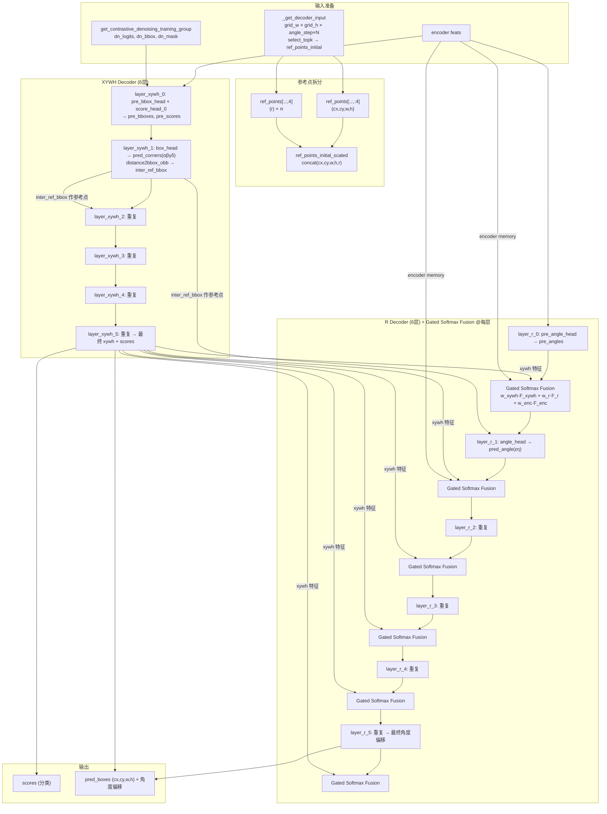

# DEIMv2-OBB Decoder 解耦设计

> 创建日期：2026-06-25
> 修订日期：2026-06-26（根据整合评审修复 F7/F8/F9/S1/S2/S3/O1-O5）
> 目的：解决分类分数与 IoU 质量无关（MAL loss 不收敛）的问题，对 decoder 进行空间-语义-角度三层解耦
> 状态：评审后修订版，待实施

## 背景

经过匈牙利匹配诊断（Q1=PASS, Q2=部分PASS, Q3=FLAG r=0.05）和合成数据集密度消融实验，确认：

1. 匹配 assignment 正确（100% 一对一），但分类分数与 IoU 几乎零相关
2. MAL loss 设计意图（分数与 IoU 正相关）无法实现，Comet 看板上 MAL loss 不下降且反复震荡
3. DEIMv2 的 HBB 模式已验证可行——(cx,cy,w,h,label) 共用 decoder 是正确的

**根因假设**：θ（角度/r）与 (cx,cy,w,h,label) 共用同一个 decoder layer 导致空间-语义-角度信息耦合。θ 同时具有几何和语义属性，需要一个独立的处理路径。参考 STD 的空间侧分支 + 渐进式预测，以及 RIO-DETR 的 Content-Driven θ 预测和正交旋转注意力。

### H0-H4 实验结论（2026-06-26 补充）

| 假设 | 结论 | 对 score↔IoU 解耦的贡献 |
|------|------|------------------------|
| H0 评测口径 | ✅ 确认（非根因，是测量假象） | 无（precision 0.0059 是假象） |
| H1 MAL 震荡 | ⚠️ 部分确认（Kendall 加权产物） | 无（MAL 实际在下降） |
| H2 matcher 从未触发 | ✅ 重要贡献因素（AP +29%） | 部分（Q3 r 从 0.05→0.084，但仍 FLAG） |
| H3 mal_iou_type 失活 | ⚠️ 代码事实确认，不影响训练 | 无 |
| H4 LQE angle 污染 | ❌ 次要因素（ρ 由负转正但 r<0.12，训练退步） | 次要 |

**结论**：H2+H4 都做了，但 Q3 r 仍只有 0.0999。matcher 修复（H2）改善了 AP 但没解决 score↔IoU 解耦。decoder 耦合假设仍待排除。

## 总体架构



### 架构关键决策（已确认）

| 决策 | 说明 |
|------|------|
| **Gate Fusion 频率** | 每个 R decoder layer 都发生（共 6 次） |
| **distance2bbox_obb** | 仅在 xywh 路径计算，`inter_ref_bbox` 传给 xywh 下一层和 R 路径 |
| **Encoder memory** | 同时注入 xywh decoder（cross-attn）和 Gated Softmax Fusion（第三路源） |
| **Mode B** | 暂不实现，先做 Mode A（label 留在 xywh 路径） |
| **参数量** | decoder 层数翻倍（6→12），在预期之内 |

## 设计要点

### 1. 保留 DEIMv2 Refinement

- 共享 decoder 的 (cx,cy,w,h) refinement（D-FINE ADR + DEIM gateway）不改动
- 这个 pipeline 在 HBB 已验证，不需要重新设计

### 2. Label 解耦：双模式（共用 / 独立）

通过配置参数 `decouple_label: true/false` 控制：

| 模式 | label 处理 | 优点 | 缺点 |
|------|-----------|------|------|
| **Mode A**（默认） | 和 (cx,cy,w,h) 共用共享 decoder | HBB baseline，改动最小 | θ 解耦后 label 仍与空间耦合 |
| **Mode B** | 独立 Label Decoder | label 不受空间干扰 | 增加参数量 |

**Mode B 细节**：
- Label Decoder 接收共享 decoder 的输出特征 + encoder memory 作为 cross-attn KV
- 使用 `Gate` 模块（`deim_utils.py:70`）门控：`Gate(f_spatial, f_label)` 融合共享 decoder 输出和 label decoder 内部特征
- Label Decoder 不需要 refinement（label 是离散的），只需要足够的 self-attn + cross-attn 层完成语义推理

### 3. 多源特征融合：Gated Softmax Fusion

**[2026-06-26 修订：修复 F9 token 数不匹配问题]**

三路径：
- **src_A**: Encoder memory 经 cross-attn 汇聚后的特征（`[B, 300, d]`）
- **src_B**: 共享 decoder 的 (cx,cy,w,h) 输出特征（`[B, 300, d]`，位置和尺寸信息）
- **src_C**: label 输出特征（Mode B 时有效；Mode A 时只用 src_A + src_B）

**关键修复**：encoder memory 原始形状是 `[B, ΣH_iW_i, d]`（多尺度特征图展平，token 数成百上千），不能直接与 `[B, 300, d]` 的 query 特征做 token 级融合。需要先通过 cross-attention 将 encoder memory 汇聚到 300 个 query 位置。

融合方式：
```
# encoder memory 先经 cross-attn 汇聚
enc_feat = cross_attn(query=r_query, key=encoder_memory, value=encoder_memory)  # [B, 300, d]

# 三源融合（所有源都是 [B, 300, d]）
cat = concat([enc_feat, src_B, src_C])          # [B, 300, 3d]
w = softmax(Linear(d→3d)→ReLU→Linear(3d→3))     # [B, 300, 3]
fused = w_A·enc_feat + w_B·src_B + w_C·src_C
```

TODO：后续在真实 DOTA 数据上对比 MoE 融合（Google V-MoE，`/home/cx/win_dir/thired/MoE/vmoe/vmoe/moe.py`）。

### 4. Angle Decoder：Rotation-Rectified Orthogonal Attention

**[2026-06-26 修订：修复 S3 边界不连续问题]**

融入 RIO-DETR 的正交旋转注意力：

```
H 个 attention head 分成两组：
  Heads 1 ~ H/2: 使用 θ 做旋转矩阵 R(θ)，采样轴向特征
  Heads H/2+1 ~ H: 使用 R(θ+π/2)，采样正交方向特征
```

当前 DEIMv2-OBB 的旋转交叉注意力只沿长轴方向采样 → 容易特征坍塌（所有采样点在一条线上）。正交注意力的第二组 head 补充了垂直于长轴的信息。

**角度表示与更新**：

**[2026-06-26 修订：修复 S2 角度 DFL 维度混淆 + S3 边界不连续]**

- **角度表示**：使用 sin/cos 编码而非直接弧度值，避免 0/π 边界不连续
  ```
  θ_encoded = [sin(2θ), cos(2θ)]  # 周期 π，无边界问题
  ```
- **角度更新**：预测 sin/cos 残差而非直接弧度增量
  ```
  # 预测
  delta_sin, delta_cos = angle_head(r_features)  # 两个标量
  
  # 更新（向量加法后归一化）
  sin_new = sin_current + delta_sin
  cos_new = cos_current + delta_cos
  norm = sqrt(sin_new^2 + cos_new^2)
  sin_current = sin_new / norm
  cos_current = cos_new / norm
  
  # 解码为弧度（用于最终输出）
  θ = 0.5 * atan2(sin_current, cos_current)  # 范围 [-π/2, π/2]，映射到 [0, π)
  ```
- **不使用 `% π`**：避免取模操作在边界处的梯度断裂

### 5. Multi-Angle Anchoring（angle_step=10°）

当前每个网格位置只有 1 个角度锚点（θ=π/2）。改为每个位置生成 18 个角度锚点：

```
angle_step = 10°  →  θ ∈ {0°, 10°, 20°, ..., 170°}  →  18 个锚点/位置
total_anchors = Σ(H_i × W_i) × 18
queries = select_topk(anchors, k=300)  # 仍然只选 300
```

匈牙利匹配会自然选出每个 GT 对应的最佳角度锚点。若硬件不足，增大 angle_step（如 30°）。

### 6. 空间→语义注意力门控

参考 DEIMv2 的 `Gate` 模式（`deim_utils.py:70-83`）：

```
f_spatial = shared_decoder_output     # 空间分支输出
f_semantic = label_or_angle_query     # 语义/角度分支的 query
gate_weights = σ(Linear(2d→2d)([f_spatial; f_semantic]))
modulated = gate1 * attn_out + gate2 * f_spatial
```

添加到 Label Decoder（Mode B）和 Angle Decoder 的自注意力或交叉注意力中。

## 配置参数一览

| 参数 | 默认值 | 说明 |
|------|--------|------|
| `decouple_label` | `False` | 是否独立 label decoder |
| `decouple_angle` | `True` | 是否独立 angle decoder |
| `angle_step` | `10` | 角度锚点步长（度） |
| `fusion_method` | `"gated_softmax"` | 多源融合方式（TODO: `"moe"`） |
| `use_orthogonal_attn` | `True` | 是否使用正交旋转注意力 |
| `gate_spatial_semantic` | `True` | 是否使用 Gate 做空间→语义门控 |

## RIO-DETR 论文核心设计

- 解耦角度与位置查询（Content-Driven Angle Estimation）
- 旋转注意力分为轴向和正交两个方向采样（Rotation-Rectified Orthogonal Attention）
- 周期性优化（Decoupled Periodic Refinement + Shortest-Path Periodic Loss）

## MoE TODO

- 基于 Google V-MoE（`/home/cx/win_dir/thired/MoE/vmoe/vmoe/moe.py`）
- 在真实 DOTA 数据上对比 Gated Softmax Fusion vs MoE Fusion
- 评估指标：角度预测精度、MAL loss 收敛性

## 自检

- [x] 所有设计要点对应明确的代码改动位置
- [x] angle_step 有硬件降级方案（增大 step）
- [x] 双模式 label 解耦有明确的配置控制
- [x] MoE 作为独立 TODO，不影响 baseline 搭建
- [x] **[2026-06-26]** F9 修复：encoder memory 先经 cross-attn 汇聚到 300 query 位置
- [x] **[2026-06-26]** S2 修复：角度用 sin/cos 编码，预测残差而非 DFL 分布
- [x] **[2026-06-26]** S3 修复：不使用 `% π`，用向量归一化保持周期性
